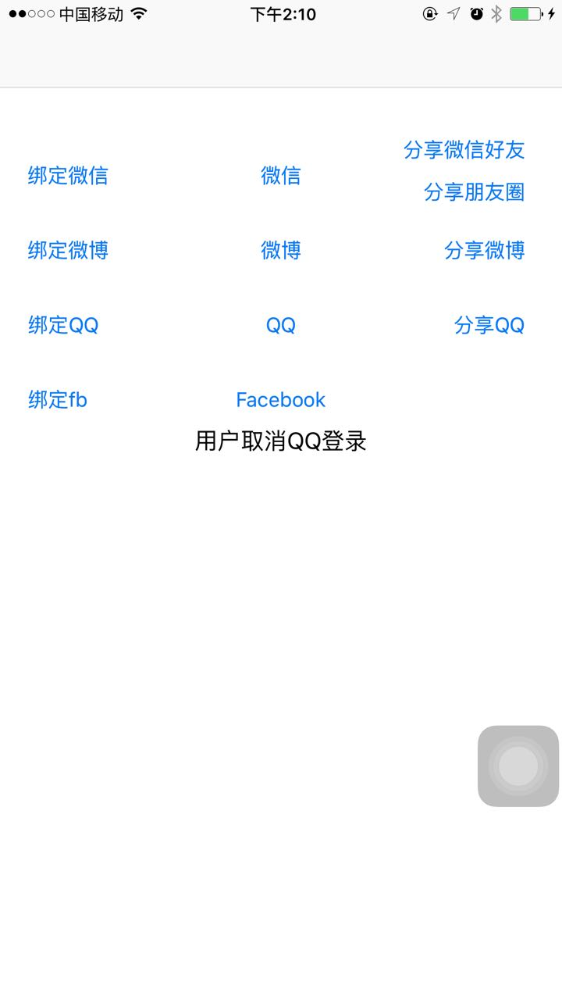

#微信、微博、QQ、facebook第三方授权、分享，获得昵称和头像。 

##配置上你自己在各个第三方申请到的ID。
####使用简单。




请使用自己的配置  #warning 配置好Key


```
#import "WMAuthManager.h"

    1、
	[WMAuthManager registerApp:WMAuthAll withApplication:application withOptions:launchOptions];
    
    2、
    return [WMAuthManager handleOpenURL:url
                            application:application
                      sourceApplication:sourceApplication
                             annotation:annotation];

    3、
    [WMAuthManager activateApp];

```
    4、授权
    __weak typeof(self) weakself = self;
    [WMAuthManager sendAuthType:WMAuthWeixin withBlock:^(NSError *error, NSString *openID, NSString *unionID) {
        [weakself getAuth:error openID:openID unionID:unionID withType:@"weixin"];
    } withUserInfo:^(NSString *userName, NSString *userAvatar) {
        [weakself showUserInfo:userName withAvatar:userAvatar];
    } withUserInfoImg:nil withController:self];

    5、分享
    [WMAuthManager shareAuthType:WMAuthWeixin title:@"分享标题" description:@"分享描述" thumb:[UIImage imageNamed:@"share_logo.jpg"] url:@"http://www.baidu.com" result:^(NSError *error) {
        if (error) {
            //[weakself showWarning:error.domain];
        } else {
            //[weakself showOK:@"已分享到微信好友"];
        }
    }];

```

#9.0适配
    <key>NSAppTransportSecurity</key>
    <dict>
    <key>NSAllowsArbitraryLoads</key>
    <true/>
    </dict>

    <key>LSApplicationQueriesSchemes</key>
    <array>
    <string>mqqapi</string>
    <string>wtloginmqq2</string>
    <string>mqqopensdkapiV3</string>
    <string>mqqwpa</string>
    <string>mqqopensdkapiV2</string>
    <string>mqqOpensdkSSoLogin</string>
    <string>mqq</string>
    <string>mqzoneopensdkapiV2</string>
    <string>mqzoneopensdkapi19</string>
    <string>mqzoneopensdkapi</string>
    <string>mqzoneopensdk</string>
    <string>mqzone</string>
    <string>sinaweibohd</string>
    <string>sinaweibo</string>
    <string>weibosdk</string>
    <string>weibosdk2.5</string>
    <string>weixin</string>
    <string>wechat</string>
    <string>fbauth</string>
    </array>

有一个问题需要注意：如果你的工程使用了Aspects，那么需要检查用户手机是否安装QQ，否则弹QQ SDK提供的web登录授权时，Aspects会抛出一个异常，造成闪退

```
    ///  0、用户手机是否安装对应第三方
    ///  @param authType 四者其一
    ///  @return 安装返回true，未安装返回false
    + (BOOL)isAppInstalled:(WMAuthType)authType;
    
    ///  1、注册第三方
    ///  @param authType      四者皆可WMAuthAll
    ///  @param application   facebook专用
    + (void)registerApp:(WMAuthType)authType
        withApplication:(UIApplication *)application
        withOptions:(NSDictionary *)launchOptions;
    
    ///  2、第三方回调响应
    ///  @param application     facebook专用
    + (BOOL)handleOpenURL:(NSURL *)url
              application:(UIApplication *)application
        sourceApplication:(NSString *)sourceApplication
               annotation:(id)annotation;
    
    ///  3、恢复状态，facebook专用
    + (void)activateApp;
    
    ///  4、发起对应第三方授权，目的是第三方授权登录或者第三方绑定
    ///  @param authType 四种其一
    ///  @param result   登录回调block，成功返回TRUE和ID，失败返回FALSE和错误信息
    ///  @param block    获取用户信息回调，成功返回用户名和头像
    ///  @param imgBlock facebook专用
    ///  @param vc       weixin专用
    + (void)sendAuthType:(WMAuthType)authType
               withBlock:(WMAuthBlock)result
            withUserInfo:(WMUserInfoBlock)block
         withUserInfoImg:(WMUserInfoImgBlock)imgBlock
          withController:(UIViewController *)vc;
    ///  4.1、同上，只是不去取用户名和头像
    ///  @param authType 四种其一
    ///  @param result   登录回调block，成功返回TRUE和ID，失败返回FALSE和错误信息
    ///  @param vc       weixin专用
    + (void)sendAuthType:(WMAuthType)authType
               withBlock:(WMAuthBlock)result
          withController:(UIViewController *)vc;
    
    ///  5、分享到对应第三方
    ///  @param authType    四种其一，以下参数的limit详见各自接口描述
    ///  @param title       标题
    ///  @param description 简要描述，对应微信时，nil朋友圈，非nil微信好友
    ///  @param image       配一张缩略图，对应微博时，nil发纯文本微博，非nil带图微博
    ///  @param url         指向链接，不能为空
    ///  @param result      回调是否成功，error为nil成功，失败error.domain原因
    + (void)shareAuthType:(WMAuthType)authType
                    title:(NSString *)title
              description:(NSString *)description
                    thumb:(UIImage *)image
                      url:(NSString *)url
                   result:(WMShareBlock)result;

```