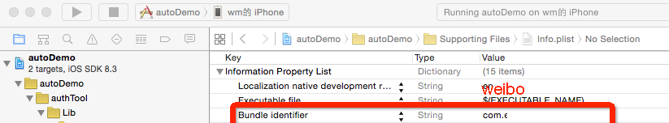

#微信、微博、QQ、facebook第三方登录授权，并获得昵称和头像。 

##DEMO是不能直接跑的，ID都置空了，一定要配置上你自己在各个第三方申请到的ID。
####使用简单。

#####欢迎关注，提交修改意见。


请使用自己的配置  #warning 配置好Key




```
	[WMAuthManager registerApp:WMAuthAll withApplication:application withOptions:launchOptions];
    
```


```
    return [WMAuthManager handleOpenURL:url
                            application:application
                      sourceApplication:sourceApplication
                             annotation:annotation];

```

```
    [WMAuthManager activateApp];

```
	    __weak typeof(self) weakself = self;
	    [WMAuthManager sendAuthType:WMAuthFacebook
	                      withBlock:^(BOOL isOK, NSString *openID) {
	                          [weakself login:isOK withInfo:openID withType:@"facebook"];
	                      }
	                   withUserInfo:nil
	                withUserInfoImg:^(NSString *userName, UIView *userAvatar) {
	                    [weakself showUserInfo:userName withAvatarImg:userAvatar];
	                }
	                 withController:self];
```

#9.0适配
    <key>NSAppTransportSecurity</key>
    <dict>
    <key>NSAllowsArbitraryLoads</key>
    <true/>
    </dict>

    <key>LSApplicationQueriesSchemes</key>
    <array>
    <string>wtloginmqq2</string>
    <string>mqqopensdkapiV3</string>
    <string>mqqwpa</string>
    <string>mqqopensdkapiV2</string>
    <string>mqqOpensdkSSoLogin</string>
    <string>mqq</string>
    <string>mqzoneopensdkapiV2</string>
    <string>mqzoneopensdkapi19</string>
    <string>mqzoneopensdkapi</string>
    <string>mqzoneopensdk</string>
    <string>mqzone</string>
    <string>sinaweibohd</string>
    <string>sinaweibo</string>
    <string>weibosdk</string>
    <string>weibosdk2.5</string>
    <string>weixin</string>
    <string>wechat</string>
    <string>fbauth</string>
    </array>